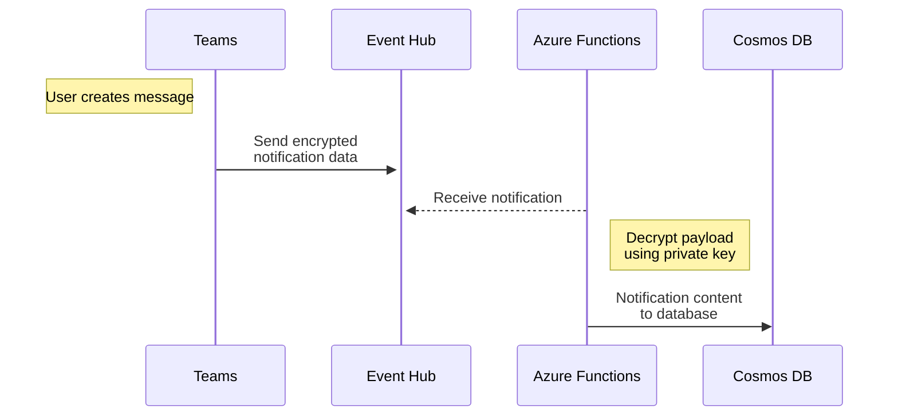

# Teams demos

Various Teams demos

## Notifications demo



Here is example encrypted notification data:

```json
{
  "value": [
    {
      "subscriptionId": "8338ed0c-ce0a-4c28-8580-6e8d79fcc159",
      "changeType": "created",
      "clientState": "<your client state from subscription>",
      "subscriptionExpirationDateTime": "2023-04-18T07:00:00-07:00",
      "resource": "teams('52855e0a-b0db-4393-af16-df781c632a91')/channels('19:3976a83f2145549e994ec6135cbd442f@thread.tacv2')/messages('1681824635411')/replies('1682825267123')",
      "resourceData": {
        "id": "1682825267123",
        "@odata.type": "#Microsoft.Graph.chatMessage",
        "@odata.id": "teams('52855e0a-b0db-4393-af16-df781c632a91')/channels('19:3976a83f2145549e994ec6135cbd442f@thread.tacv2')/messages('1681824635411')/replies('1682825267123')"
      },
      "encryptedContent": {
        "data": "<encrypted notification data>",
        "dataSignature": "<signature>",
        "dataKey": "<data key>",
        "encryptionCertificateId": "<your certificate identifier from subscription>",
        "encryptionCertificateThumbprint": "<your certificate thumbprint>"
      },
      "tenantId": "cbf8b53b-3ab5-4802-9021-57f1d15c157a"
    }
  ]
}
```

Here is example decrypted notification data:

```json
{
  "@odata.context": "https://graph.microsoft.com/$metadata#teams('cbf8b53b-3ab5-4802-9021-57f1d15c157a')/channels('19%3976a83f2145549e994ec6135cbd442f%40thread.tacv2')/messages('1681824635411')/replies/$entity",
  "id": "1681825367023",
  "replyToId": "1681824534411",
  "etag": "1681825367023",
  "messageType": "message",
  "createdDateTime": "2023-04-18T13:41:07.023Z",
  "lastModifiedDateTime": "2023-04-18T13:41:07.023Z",
  "lastEditedDateTime": null,
  "deletedDateTime": null,
  "subject": "",
  "summary": null,
  "chatId": null,
  "importance": "normal",
  "locale": "en-us",
  "webUrl": "https://teams.microsoft.com/l/message/19%3976a83f2145549e994ec6135cbd442f%40thread.tacv2/1681824635411?groupId=66f0865a-afce-4447-b56b-9c72230573e7&tenantId=cbf8b53b-3ab5-4802-9021-57f1d15c157a&createdTime=1681825267023&parentMessageId=1681825534511",
  "from": {
    "application": null,
    "device": null,
    "user": {
      "userIdentityType": "aadUser",
      "id": "69d98ca2-760c-476e-b6c6-2a2e40d2b76f",
      "displayName": "Jane Done",
      "tenantId": "cbf8b53b-3ab5-4802-9021-57f1d15c157a"
    }
  },
  "body": {
    "contentType": "html",
    "content": "<p>Good morning!</p>"
  },
  "channelIdentity": {
    "teamId": "52855e0a-b0db-4393-af16-df781c632a91",
    "channelId": "19:3976a83f2145549e994ec6135cbd442f@thread.tacv2"
  },
  "attachments": [],
  "mentions": [],
  "onBehalfOf": null,
  "policyViolation": null,
  "reactions": [],
  "messageHistory": [],
  "replies": [],
  "hostedContents": [],
  "eventDetail": null
}
```

## Links

[Set up notifications for changes in resource data](https://learn.microsoft.com/en-us/graph/webhooks)

[Reduce missing subscriptions and change notifications](https://learn.microsoft.com/en-us/graph/webhooks-lifecycle)

[Decrypting resource data from change notifications](https://learn.microsoft.com/en-us/graph/webhooks-with-resource-data#decrypting-resource-data-from-change-notifications)

[Notification payloads](https://learn.microsoft.com/en-us/graph/teams-changenotifications-chatmessage#notification-payloads)